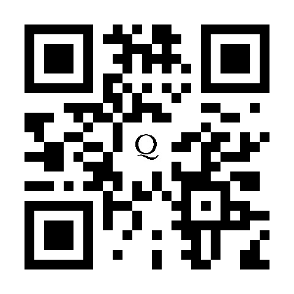

<div align="center"></div>

# Qrbit

[](https://codecov.io/gh/jaredwray/qrbit)
[](https://github.com/jaredwray/qrbit/actions/workflows/tests.yml)
[](https://www.npmjs.com/package/qrbit)
[](https://www.npmjs.com/package/qrbit)
[](https://github.com/jaredwray/qrbit/blob/main/LICENSE)

A fast QR code generator with logo embedding support, built with Rust and native node packages for best performance while avoiding additional modules (example: canvas).

# Features

- **Fast**: Built with Rust (for logos) for maximum performance and caching 🚀
- **Fast SVG**: High performance SVG support via `QrCode` when no logo is needed
- **Cross-platform**: Works on iOS, Windows, Linux, and macOS
- **Logo embedding**: Add custom logos to your QR codes with no need for node canvas!
- **Customizable**: Custom colors, sizes, and margins
- **Multiple formats**: Generate SVG, PNG, JPEG, and WebP outputs
- **Scalable**: With caching you can also use a secondary store for persistence
- **Well-tested**: Comprehensive test coverage with Vitest
- **Maintained**: Actively maintained with regular updates

# Table of Contents
- [Installation](#installation)
- [Reqirements](#requirements)
- [API](#api)
  - [Constructor](#constructoroptions-qroptions)
  - [Properties](#properties)
  - [Methods](#methods)
- [Benchmarks](#benchmarks)
- [Examples](#examples)
- [Contributing](#contributing)
- [License and Copyright](#license-and-copyright)

# Installation

```bash
npm install qrbit
```

# Requirements

- Node.js >= 18
- Supported platforms: Windows (x86, x64), macOS (Arm, Intel), Linux (x64)

# Usage

```javascript
const qr = new QrBit({ text: "https://github.com/jaredwray/qrbit", size: 200 });
const svg = await qr.toSvg();
console.log(svg); // here is the svg!
```

Here is how you add a logo:

```javascript
const qr = new QrBit({ 
  text: "https://github.com/jaredwray/qrbit", 
  logo: '/path/to/logo.png',
  size: 200 });
const svg = await qr.toSvg();
console.log(svg); // here is the svg with an embedded logo!
```

```javascript
const qr = new QrBit({ 
  text: "https://github.com/jaredwray/qrbit", 
  logo: '/path/to/logo.png',
  size: 200 });
const png = await qr.toPng(); // buffer of the png!
```

# API

## constructor(options: QrOptions)

Creates a new QrBit instance with the specified options.

**Parameters:**
- `options` (QrOptions): Configuration object for the QR code

```typescript
interface QrOptions {
  text: string;                    // The text content to encode
  size?: number;                   // Size in pixels (default: 200)
  margin?: number;                 // Margin in pixels (default: undefined)
  logo?: string | Buffer;          // Logo file path or buffer
  logoSizeRatio?: number;          // Logo size ratio (default: 0.2)
  backgroundColor?: string;        // Background color (default: "#FFFFFF")
  foregroundColor?: string;        // Foreground color (default: "#000000")
  cache?: Cacheable | boolean;     // Caching configuration (default: true)
}

interface toOptions {
  cache?: boolean;                 // Enable/disable caching (default: true)
  quality?: number;                // Quality 1-100 (default: 90) - for toJpg; reserved for toWebp
}
```

**Example:**
```javascript
import { QrBit } from 'qrbit';

const qr = new QrBit({
  text: "https://github.com/jaredwray/qrbit",
  size: 300,
  margin: 20,
  logo: "./logo.png",
  logoSizeRatio: 0.25,
  backgroundColor: "#FFFFFF",
  foregroundColor: "#000000"
});
```

## Properties

### text
Get or set the text content for the QR code.

```javascript
const qr = new QrBit({ text: "Hello World" });
console.log(qr.text); // "Hello World"
qr.text = "New content";
```

### size
Get or set the size of the QR code in pixels.

```javascript
const qr = new QrBit({ text: "Hello World" });
console.log(qr.size); // 200 (default)
qr.size = 400;
```

### margin
Get or set the margin around the QR code in pixels.

```javascript
const qr = new QrBit({ text: "Hello World" });
console.log(qr.margin); // undefined (default)
qr.margin = 20;
```

### logo
Get or set the logo as a file path or buffer.

```javascript
const qr = new QrBit({ text: "Hello World" });
qr.logo = "./path/to/logo.png";
// or
qr.logo = fs.readFileSync("./logo.png");
```

### logoSizeRatio
Get or set the logo size ratio relative to QR code size (0.0 to 1.0).

```javascript
const qr = new QrBit({ text: "Hello World" });
qr.logoSizeRatio = 0.3; // 30% of QR code size
```

### backgroundColor
Get or set the background color in hex format.

```javascript
const qr = new QrBit({ text: "Hello World" });
qr.backgroundColor = "#FF0000"; // Red background
```

### foregroundColor
Get or set the foreground color in hex format.

```javascript
const qr = new QrBit({ text: "Hello World" });
qr.foregroundColor = "#FFFFFF"; // White foreground
```

### cache
Get or set the cache instance for performance optimization.

```javascript
import { Cacheable } from 'cacheable';

const qr = new QrBit({ text: "Hello World" });
qr.cache = new Cacheable(); // Custom cache instance
qr.cache = false; // Disable caching
```

## Methods

### .toSvg(options?: toOptions)

Generate SVG QR code with optional caching. Uses native QRCode library for simple cases, Rust implementation for logos.

**Parameters:**
- `options.cache?: boolean` - Whether to use caching (default: true)

**Returns:** Promise<string> - The SVG string

```javascript
const qr = new QrBit({ text: "Hello World" });
const svg = await qr.toSvg();
console.log(svg); // <svg xmlns="http://www.w3.org/2000/svg"...

// Without caching
const svgNoCache = await qr.toSvg({ cache: false });
```

### .toSvgFile(filePath: string, options?: toOptions)

Generate SVG QR code and save it to a file. Creates directories if they don't exist.

**Parameters:**
- `filePath: string` - The file path where to save the SVG
- `options.cache?: boolean` - Whether to use caching (default: true)

**Returns:** Promise<void>

```javascript
const qr = new QrBit({ text: "Hello World" });
await qr.toSvgFile("./output/qr-code.svg");

// With options
await qr.toSvgFile("./output/qr-code.svg", { cache: false });
```

### .toPng(options?: toOptions)

Generate PNG QR code with optional caching. Uses high-performance SVG to PNG conversion.

**Parameters:**
- `options.cache?: boolean` - Whether to use caching (default: true)

**Returns:** Promise<Buffer> - The PNG buffer

```javascript
const qr = new QrBit({ text: "Hello World" });
const pngBuffer = await qr.toPng();

// Save to file
fs.writeFileSync("qr-code.png", pngBuffer);

// Without caching
const pngNoCache = await qr.toPng({ cache: false });
```

### .toPngFile(filePath: string, options?: toOptions)

Generate PNG QR code and save it to a file. Creates directories if they don't exist.

**Parameters:**
- `filePath: string` - The file path where to save the PNG
- `options.cache?: boolean` - Whether to use caching (default: true)

**Returns:** Promise<void>

```javascript
const qr = new QrBit({ text: "Hello World" });
await qr.toPngFile("./output/qr-code.png");

// With options
await qr.toPngFile("./output/qr-code.png", { cache: false });
```

### .toJpg(options?: toOptions)

Generate JPEG QR code with optional caching and quality control. Uses high-performance SVG to JPEG conversion.

**Parameters:**
- `options.cache?: boolean` - Whether to use caching (default: true)
- `options.quality?: number` - JPEG quality from 1-100 (default: 90)

**Returns:** Promise<Buffer> - The JPEG buffer

```javascript
const qr = new QrBit({ text: "Hello World" });
const jpgBuffer = await qr.toJpg();

// With high quality
const jpgHigh = await qr.toJpg({ quality: 95 });

// With compression for smaller file size
const jpgCompressed = await qr.toJpg({ quality: 70 });

// Save to file
fs.writeFileSync("qr-code.jpg", jpgBuffer);

// Without caching
const jpgNoCache = await qr.toJpg({ cache: false, quality: 85 });
```

### .toJpgFile(filePath: string, options?: toOptions)

Generate JPEG QR code and save it to a file. Creates directories if they don't exist.

**Parameters:**
- `filePath: string` - The file path where to save the JPEG
- `options.cache?: boolean` - Whether to use caching (default: true)
- `options.quality?: number` - JPEG quality from 1-100 (default: 90)

**Returns:** Promise<void>

```javascript
const qr = new QrBit({ text: "Hello World" });
await qr.toJpgFile("./output/qr-code.jpg");

// With high quality
await qr.toJpgFile("./output/qr-code.jpg", { quality: 95 });

// With compression
await qr.toJpgFile("./output/qr-code.jpg", { quality: 70, cache: false });
```

### .toWebp(options?: toOptions)

Generate WebP QR code with optional caching. Uses high-performance SVG to WebP conversion with lossless encoding.

**Parameters:**
- `options.cache?: boolean` - Whether to use caching (default: true)
- `options.quality?: number` - Reserved for future lossy WebP support

**Returns:** Promise<Buffer> - The WebP buffer

```javascript
const qr = new QrBit({ text: "Hello World" });
const webpBuffer = await qr.toWebp();

// Save to file
fs.writeFileSync("qr-code.webp", webpBuffer);

// Without caching
const webpNoCache = await qr.toWebp({ cache: false });
```

### .toWebpFile(filePath: string, options?: toOptions)

Generate WebP QR code and save it to a file. Creates directories if they don't exist.

**Parameters:**
- `filePath: string` - The file path where to save the WebP
- `options.cache?: boolean` - Whether to use caching (default: true)
- `options.quality?: number` - Reserved for future lossy WebP support

**Returns:** Promise<void>

```javascript
const qr = new QrBit({ text: "Hello World" });
await qr.toWebpFile("./output/qr-code.webp");

// With options
await qr.toWebpFile("./output/qr-code.webp", { cache: false });
```

### Static Methods

#### QrBit.convertSvgToPng(svgContent: string, width?: number, height?: number)

Convert SVG content to PNG buffer using the native Rust implementation.

**Parameters:**
- `svgContent: string` - The SVG content as a string
- `width?: number` - Optional width for the PNG output
- `height?: number` - Optional height for the PNG output

**Returns:** Buffer - The PNG buffer

```javascript
const svg = '<svg>...</svg>';
const pngBuffer = QrBit.convertSvgToPng(svg, 400, 400);
```

#### QrBit.convertSvgToJpeg(svgContent: string, width?: number, height?: number, quality?: number)

Convert SVG content to JPEG buffer using the native Rust implementation.

**Parameters:**
- `svgContent: string` - The SVG content as a string
- `width?: number` - Optional width for the JPEG output
- `height?: number` - Optional height for the JPEG output
- `quality?: number` - JPEG quality from 1-100 (default: 90)

**Returns:** Buffer - The JPEG buffer

```javascript
const svg = '<svg>...</svg>';
const jpegBuffer = QrBit.convertSvgToJpeg(svg, 400, 400, 85);
```

#### QrBit.convertSvgToWebp(svgContent: string, width?: number, height?: number, quality?: number)

Convert SVG content to WebP buffer using the native Rust implementation with lossless encoding.

**Parameters:**
- `svgContent: string` - The SVG content as a string
- `width?: number` - Optional width for the WebP output
- `height?: number` - Optional height for the WebP output
- `quality?: number` - Reserved for future lossy WebP support

**Returns:** Buffer - The WebP buffer

```javascript
const svg = '<svg>...</svg>';
const webpBuffer = QrBit.convertSvgToWebp(svg, 400, 400);
```

# Benchmarks

## QR Codes SVG (No Logo)
|                  name                   |  summary  |  ops/sec  |  time/op  |  margin  |  samples  |
|-----------------------------------------|:---------:|----------:|----------:|:--------:|----------:|
|  QRCode toString (v1.5.4)               |    🥇     |       6K  |    162µs  |  ±0.37%  |       6K  |
|  QrBit toSvg (Native) (v1.0.0)          |   -3.2%   |       6K  |    172µs  |  ±0.92%  |       6K  |
|  QrBit toSvg (Rust) (v1.0.0)            |   -85%    |     945   |      1ms  |  ±1.17%  |     912   |
|  styled-qr-code-node toBuffer (v1.5.2)  |   -89%    |     709   |      1ms  |  ±1.07%  |     701   |

`Rust` is there for performance and when doing heavy image processing without needing node `canvas` installed. If you do not add a logo then the `Native` version is what you will get for SVG. 

## QR Codes PNG (No Logo)
|                  name                   |  summary  |  ops/sec  |  time/op  |  margin  |  samples  |
|-----------------------------------------|:---------:|----------:|----------:|:--------:|----------:|
|  QrBit toPng (v1.0.0)                   |    🥇     |       2K  |    647µs  |  ±0.68%  |       2K  |
|  QRCode toBuffer (v1.5.4)               |   -49%    |     804   |      1ms  |  ±0.77%  |     794   |
|  styled-qr-code-node toBuffer (v1.5.2)  |   -85%    |     238   |      4ms  |  ±0.74%  |     238   |

## QR Codes JPG (No Logo)
|                  name                   |  summary  |  ops/sec  |  time/op  |  margin  |  samples  |
|-----------------------------------------|:---------:|----------:|----------:|:--------:|----------:|
|  QrBit toJpg (v1.2.0)                   |    🥇     |     663   |      2ms  |  ±0.37%  |     662   |
|  styled-qr-code-node toBuffer (v1.5.2)  |   -36%    |     424   |      2ms  |  ±2.13%  |     418   |

`Rust` is used for `toPng()`, `toJpg()`, and `toWebp()` to optimize performance for image generation and heavy image processing without needing node `canvas` installed.

## QR Codes with Embedded Logos
|                name                |  summary  |  ops/sec  |  time/op  |  margin  |  samples  |
|------------------------------------|:---------:|----------:|----------:|:--------:|----------:|
|  QrBit SVG (Path) (v1.0.0)         |    🥇     |     819   |      1ms  |  ±1.04%  |     794   |
|  QrBit SVG (Buffer) (v1.0.0)       |   -58%    |     341   |      3ms  |  ±1.08%  |     339   |
|  QrBit PNG (Path) (v1.0.0)         |   -61%    |     319   |      3ms  |  ±1.95%  |     314   |
|  styled-qr-code-node PNG (v1.5.2)  |   -81%    |     159   |      6ms  |  ±0.75%  |     159   |
|  QrBit PNG (Buffer) (v1.0.0)       |   -81%    |     154   |      7ms  |  ±1.05%  |     154   |
|  styled-qr-code-node SVG (v1.5.2)  |   -84%    |     134   |      7ms  |  ±0.59%  |     135   |

`Buffer` is much slower as we have to push the stream across to the rust module. For fastest performance provide the path of the image.

## QR Codes SVG with Caching
|                  name                   |  summary  |  ops/sec  |  time/op  |  margin  |  samples  |
|-----------------------------------------|:---------:|----------:|----------:|:--------:|----------:|
|  QrBit toSvg (Native) (v1.0.0)          |    🥇     |      95K  |     94µs  |  ±2.08%  |      11K  |
|  QRCode toString (v1.5.4)               |   -93%    |       6K  |    161µs  |  ±0.37%  |       6K  |
|  QrBit toSvg (Rust) (v1.0.0)            |   -99%    |     938   |      1ms  |  ±1.12%  |     907   |
|  styled-qr-code-node toBuffer (v1.5.2)  |   -99%    |     710   |      1ms  |  ±1.10%  |     700   |


## QR Codes PNG with Caching
|                  name                   |  summary  |  ops/sec  |  time/op  |  margin  |  samples  |
|-----------------------------------------|:---------:|----------:|----------:|:--------:|----------:|
|  QrBit toPng (v1.0.0)                   |    🥇     |      13K  |    584µs  |  ±1.84%  |       2K  |
|  QRCode toBuffer (v1.5.4)               |   -94%    |     760   |      1ms  |  ±1.54%  |     741   |
|  styled-qr-code-node toBuffer (v1.5.2)  |   -98%    |     233   |      4ms  |  ±2.10%  |     231   |

# Examples

The `examples/` directory contains various QR code examples showcasing different features and use cases. You can generate these examples by running:

```bash
pnpm generate-examples
```

## 1. Basic QR Code
Simple QR code with default settings.
```javascript
const qr = new QrBit({ text: "Hello World!" });
await qr.toPngFile("01_basic.png");
```


## 2. URL QR Code  
QR code encoding a GitHub URL.
```javascript
const qr = new QrBit({ text: "https://github.com/jaredwray/qrbit", size: 200 });
await qr.toSvgFile("02_url.svg");
```


## 3. Large Size QR Code
QR code with increased size for better scanning.
```javascript
const qr = new QrBit({ text: "Large QR", size: 400 });
await qr.toPngFile("03_large_size.png");
```


## 4. Inverted Colors
Black background with white foreground.
```javascript
const qr = new QrBit({
  text: "Inverted Colors",
  backgroundColor: "#000000",
  foregroundColor: "#FFFFFF"
});
await qr.toSvgFile("04_inverted.svg");
```


## 5. Red Theme
Custom red background theme.
```javascript
const qr = new QrBit({
  text: "Red Theme",
  backgroundColor: "#FF0000",
  foregroundColor: "#FFFFFF"
});
await qr.toPngFile("05_red_theme.png");
```


## 6. Small Logo
QR code with a small embedded logo.
```javascript
const qr = new QrBit({
  text: "logo small",
  logo: "./logo.png",
  logoSizeRatio: 0.2
});
await qr.toPngFile("06_logo_small.png");
```


## 7. Large Logo with Custom Colors
Large logo with red background theme.
```javascript
const qr = new QrBit({
  text: "logo large red",
  logo: "./logo.png",
  size: 400,
  logoSizeRatio: 0.3,
  backgroundColor: "#FF0000",
  foregroundColor: "#FFFFFF"
});
await qr.toSvgFile("07_logo_large_red.svg");
```


## 8. WiFi QR Code
QR code for WiFi network connection.
```javascript
const qr = new QrBit({ 
  text: "WIFI:T:WPA;S:MyNetwork;P:MyPassword;;" 
});
await qr.toPngFile("08_wifi.png");
```


## 9. Large Margin with Blue Theme
Custom margin and blue color scheme.
```javascript
const qr = new QrBit({
  text: "https://github.com/jaredwray/qrbit",
  size: 300,
  margin: 40,
  backgroundColor: "#0000FF",
  foregroundColor: "#FFFFFF"
});
await qr.toSvgFile("09_large_margin_blue.svg");
```


## 10. Buffer Logo
Using a logo loaded from a Buffer instead of file path.
```javascript
const logoBuffer = fs.readFileSync("./logo.png");
const qr = new QrBit({
  text: "Buffer Logo",
  logo: logoBuffer,
  logoSizeRatio: 0.2,
  backgroundColor: "#F0F0F0",
  foregroundColor: "#333333"
});
await qr.toPngFile("10_buffer_logo.png");
```


## 11. High Quality JPEG
JPEG format with high quality setting.
```javascript
const qr = new QrBit({
  text: "High Quality JPEG",
  size: 300
});
await qr.toJpgFile("11_jpg_high_quality.jpg", { quality: 95 });
```


## 12. JPEG with Logo and Blue Theme
JPEG with embedded logo and custom blue background.
```javascript
const qr = new QrBit({
  text: "JPEG with Logo",
  logo: "./logo.png",
  size: 400,
  logoSizeRatio: 0.25,
  backgroundColor: "#2196F3",
  foregroundColor: "#FFFFFF"
});
await qr.toJpgFile("12_jpg_logo_blue.jpg", { quality: 90 });
```


## 13. Compressed JPEG with Green Theme
JPEG with lower quality for smaller file size.
```javascript
const qr = new QrBit({
  text: "https://github.com/jaredwray/qrbit",
  size: 300,
  backgroundColor: "#4CAF50",
  foregroundColor: "#FFFFFF"
});
await qr.toJpgFile("13_jpg_compressed_green.jpg", { quality: 70 });
```


## 14. JPEG with Buffer Logo and Orange Theme
JPEG using buffer-based logo with orange background.
```javascript
const logoBuffer = fs.readFileSync("./logo.png");
const qr = new QrBit({
  text: "JPEG Buffer Logo",
  logo: logoBuffer,
  size: 350,
  logoSizeRatio: 0.2,
  backgroundColor: "#FF9800",
  foregroundColor: "#FFFFFF"
});
await qr.toJpgFile("14_jpg_buffer_logo_orange.jpg", { quality: 85 });
```


## 15. Basic WebP
WebP format with lossless encoding.
```javascript
const qr = new QrBit({
  text: "Basic WebP QR Code",
  size: 300
});
await qr.toWebpFile("15_webp_basic.webp");
```


## 16. WebP with Logo and Blue Theme
WebP with embedded logo and custom blue background.
```javascript
const qr = new QrBit({
  text: "WebP with Logo",
  logo: "./logo.png",
  size: 400,
  logoSizeRatio: 0.25,
  backgroundColor: "#1e3a5f",
  foregroundColor: "#FFFFFF"
});
await qr.toWebpFile("16_webp_logo_blue.webp");
```


## 17. Large WebP with Green Theme
Large WebP QR code with green color scheme.
```javascript
const qr = new QrBit({
  text: "https://github.com/jaredwray/qrbit",
  size: 500,
  backgroundColor: "#4CAF50",
  foregroundColor: "#FFFFFF"
});
await qr.toWebpFile("17_webp_large_green.webp");
```


## 18. WebP with Buffer Logo and Purple Theme
WebP using buffer-based logo with purple background.
```javascript
const logoBuffer = fs.readFileSync("./logo.png");
const qr = new QrBit({
  text: "WebP Buffer Logo",
  logo: logoBuffer,
  size: 350,
  logoSizeRatio: 0.2,
  backgroundColor: "#9C27B0",
  foregroundColor: "#FFFFFF"
});
await qr.toWebpFile("18_webp_buffer_logo_purple.webp");
```


These examples demonstrate the versatility and capabilities of QrBit for generating QR codes with various customizations, from simple text encoding to complex styled codes with embedded logos, supporting SVG, PNG, JPEG, and WebP formats.

## Contributing

Please read our [Contributing Guidelines](./CONTRIBUTING.md) and also our [Code of Conduct](./CODE_OF_CONDUCT.md). 

## License and Copyright

[MIT & Copyright (c) Jared Wray](https://github.com/jaredwray/qrbit/blob/main/LICENSE)
